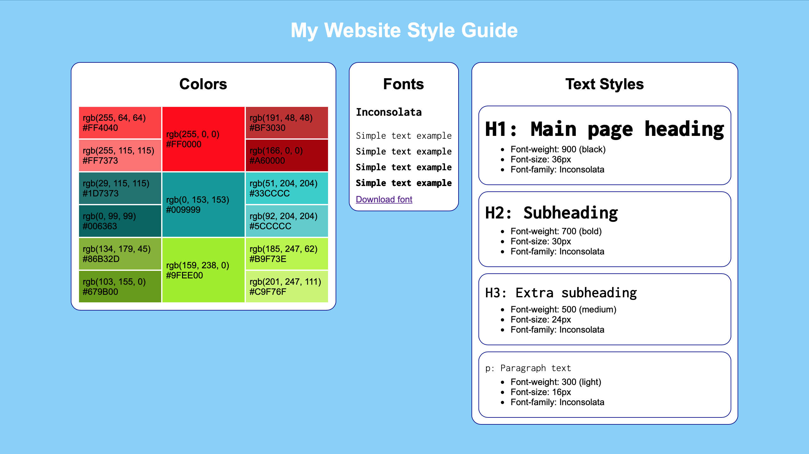

# My Website Style Guide

In this project, I've built my own basic design system for a website.

>This webpage is written within the [Codecademy](https://www.codecademy.com) Full-Stack Career Path.

  

## Web page preview
